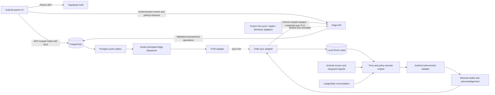

# Architecture

- **Goal:** Deliver simple total screen-time control with offline local execution and isolated household access.
- **Context:** Android-only MVP, up to 5,000 devices for load testing, small team, Supabase preferred.
- **Constraints:** No microservices, separate queues/databases, cloud clock, surveillance, or production feature implementation in this pass.
- **Done when:** Boundaries and failure semantics are implementable; risky assumptions have ADRs and falsification tests.

## Recommended components

Native Kotlin/Jetpack Compose parent; native Kotlin child with a small platform-independent domain core.
Supabase Auth for parents, PostgreSQL for policies/operations/status, RLS for parent-visible rows, Edge Functions for controlled writes and device endpoints.
Use the same PostgreSQL database for a small durable push outbox and rate-limit counters.
FCM is a sync hint. Realtime is deferred; optional later invalidations must trigger an authoritative read.

Supabase distinguishes public publishable keys from elevated backend-only secret keys; the latter bypass RLS.
A public project key is not a user identity. Device credentials are KidRemote gateway credentials, not Supabase Auth sessions.
[API keys](https://supabase.com/docs/guides/getting-started/api-keys), [RLS](https://supabase.com/docs/guides/database/postgres/row-level-security).

## Responsibilities

| Concern | Server | Parent | Child |
| --- | --- | --- | --- |
| Identity | Verify parent JWT/device hash; membership/revocation checks | Own session and recovery | Own scoped credential only |
| Pairing | Single-use atomic claim; derive household from session | Create/cancel own session; display QR | Scan with consent; store returned identity |
| Policy | Canonical ordered desired state | Submit intent, show pending vs acknowledged | Persist newer snapshot atomically |
| Allowance | Recurring limit and canonical dated grants | Explicit initial limit and additions | Compute remaining from local used time |
| Consumption | Store latest minimal report, never run countdown | Timestamp report; no fake online countdown | Monotonic measurement, reconciliation, daily reset |
| Enforcement | No live device control privilege | Explain supported boundaries | Local adapter applies desired restriction |
| Push | Outbox/dispatch/retry/provider registration | None required for MVP | Hint → authenticated sync |
| Health | Server receipt time and latest health | Freshness + severity + pending status | Observe permission/service/clock state honestly |
| Deletion | Authenticated account/device lifecycle | Visible removal and consequences | Next-contact revocation, local clear/recovery |
| Observability | Latency/error/rate counts; redacted IDs | Minimal failures, no credentials | Totals/health, no content/history |

## Trust boundaries

1. Parent app → Auth/API: input is untrusted; validate signatures, expiry, role, membership and payload on every operation.
2. RLS boundary: parent reads only own membership-derived household/device rows; private schemas/tables are not directly exposed.
3. Device → gateway: independently verify credential, derive device ID, reject client-supplied foreign target; do not accept a parent token in this route.
4. Gateway → privileged database: elevated credentials bypass RLS, so scoped database transactions and negative endpoint tests are mandatory.
5. Provider → mobile push: hint is untrusted and non-authoritative; it cannot add time, unlock, select a backend host, or enrol a device.
6. App → Android OS: OS supplies signals and privileges; consumer app is not a device owner or trusted kernel.
7. Device storage → backup/ADB/root: Android Keystore wrapping and backup exclusion protect normal installations, not a compromised OS.

## Data and policy

[BACKEND](product-specs/BACKEND.md) specifies tables, keys, RLS and transaction boundaries.
[CONTRACT](../packages/protocol/CONTRACT.md) specifies versioning, errors, sync, acknowledgements and retry.
[STATE-MACHINE](product-specs/STATE-MACHINE.md) specifies lock reasons, period-scoped grants and daily reset.
Canonical state never overwrites a child's locally measured consumption with stale server-reported usage.

## Offline execution and recovery

Persist recurring policy, current day's aggregate usage, canonical bonus, manual lock, applied version, clock anchor, health and pending acknowledgements.
Local expiry does not contact the server. Offline additions are impossible until delivered; parent text must say pending.
Push loss, restart, resume, reconnect and best-effort background work all lead to the same sync endpoint.

Room is recommended for transactional state/command receipts; exact library version is **UNSPECIFIED**.
Android recommends Room over direct SQLite for structured persistence.
[Room](https://developer.android.com/training/data-storage/room).
Keystore protects keys; encrypted credential bytes live in app-private storage excluded from backup; Room is not automatically an encrypted database.
[Android Keystore](https://developer.android.com/privacy-and-security/keystore).

## Enforcement conclusion

Candidate A: UsageStats reconciliation plus a minimal, explicitly consented Accessibility enforcement adapter.
This is a feasibility recommendation, not production acceptance: the current Android assistive-tool guidance and Play's broader conditional policy require explicit review.
Legacy Device Admin cannot keep the child from unlocking with their own PIN. Device Owner/DPC and Lock Task provide stronger managed control with a different provisioning model.
The product must never say “unbreakable.” See [ADR-0002](adr/0002-android-enforcement.md) and [POLICY](POLICY.md).

The two-second expiry target is a measured target on a published healthy physical-device set.
No Android documentation proves that all OEMs, force-stopped apps, or revoked services can meet it.
Existing application code and physical results: **UNSPECIFIED**.

## Future boundaries

`PushTransport` provides registration/address changes and “sync requested” callbacks; no policy decisions.
`UsageSignalSource`, `TimeSource`, `StateStore`, `EnforcementAdapter`, and `DeviceSync` are internal design interfaces, not claimed SDK types.
Keep Google libraries out of the time engine and wire protocol. Future Fire implementation may use ADM directly or A3L Messaging.
Apple uses native Screen Time frameworks and entitlement-controlled authorization, not the Android service lifecycle.
Windows enforcement and privilege model: **UNSPECIFIED**.
[Future ADR](adr/0007-future-platforms.md).

## Deliberate limits

Single backend project per environment; no Kubernetes/Kafka/microservices/extra database.
Separate dev/staging/prod Supabase/Firebase projects when provisioning is authorized; regions/budget/tier are **UNSPECIFIED**.
No production SQL is exposed in this pass. No background worker's continued life is assumed.
