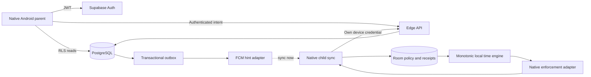

# KidRemote initial architecture and project setup

- **Goal:** Leave a source-of-truth architecture, reviewable decisions, ten bounded issues and a feasible first sprint.
- **Context:** New public repository; Android parent/child MVP; official-documentation review 2026-09-05.
- **Constraints:** Architecture/scaffolding only, no production features, truthful unknowns and creation status.
- **Done when:** A new agent can pick up KR-001/002, follow dependencies/specs, run appropriate checks and identify completion objectively.

## A. EXECUTIVE SUMMARY

The approved baseline is native Kotlin/Compose parent, native Kotlin child with a small pure time/policy core, Supabase Auth/PostgreSQL/RLS/Edge,
and FCM as a hint to synchronize. Store downloaded recurring policy, local consumption and receipts transactionally on the child.
The server orders desired state and dated grants; it never runs the child's countdown.
See [ARCHITECTURE](ARCHITECTURE.md).

Largest risk: a normal consumer installation cannot provide managed-device resistance to disable/uninstall/force-stop.
Current Android Accessibility guidance and Play conditional uses require explicit feasibility/policy assessment.
Clock trust after offline reboot and mobile background/push behaviour also limit guarantees.
[Enforcement ADR](adr/0002-android-enforcement.md),
[Android guidance](https://developer.android.com/guide/topics/ui/accessibility/service),
[Play API policy](https://support.google.com/googleplay/android-developer/answer/16558241).

The 2026-09-05 owner directive approves the documented recommendations for Unlock, time definition, timezone/reset,
uncertain accounting/offline reboot, framework/authentication/household choices, pairing/credential lifetime and technical retention.
External evidence and facts remain **UNSPECIFIED** as recorded in [DECISIONS](DECISIONS.md).
First build bounded feasibility evidence, local RLS tests and pairing transaction tests.
Production enforcement, final pairing, public database exposure and store submission remain gated.

## B. PRODUCT / MVP SPECIFICATION

Parent: sign up/login/logout → MY DEVICES → QR pairing → daily limit → timestamped remaining/health → +10/+30/Lock/Unlock.
Child: visible enrollment → independent device identity → separate consent/permission setup → local accounting/enforcement → minimal receipt/health.
All required UI/network/error states and non-features are in [PRODUCT](PRODUCT.md).

Approved state:

```text
remaining = max(0, daily_limit + today's_bonus - used)
policy_blocked = manual_lock OR remaining <= 0
```

Unlock clears manual lock only. Add time does not clear manual lock. Daily reset clears used/bonus, retains recurring limit and manual lock.
Limit edits preserve used time. Dated additions expire with their household day.
Use interactive + keyguard-hidden permitted time, household-confirmed IANA zone, midnight reset and no carry-over.
Offline same-boot expiry/reset works from downloaded state; offline reboot retains current balance and defers new-day credit while clock uncertain.
Full truth/transition tables, numeric examples and day/clock semantics: [STATE-MACHINE](product-specs/STATE-MACHINE.md).

No location, browsing/content/message monitoring, media capture, detailed app analytics, ads, per-app limits, schedules,
chores, payments, AI monitoring or future-platform implementation.
Every currently unknown product/version/budget/brand/legal/support item is consolidated in [DECISIONS](DECISIONS.md).

## C. ARCHITECTURE



Responsibility/trust tables: [ARCHITECTURE](ARCHITECTURE.md).
Normalized entities and ER/RLS matrix: [BACKEND](product-specs/BACKEND.md), including profiles, households/members,
devices, sessions, credentials, policies, commands/grants/receipts, latest state, provider addresses, outbox and audit/rate tables.

[Protocol](../packages/protocol/CONTRACT.md): UUID operations, verified actors, server sequence/timestamp, period/version preconditions,
atomic desired state + immutable dated grants, absolute local bonus merge, separate persisted/applied receipt,
bounded sync/retry, obsolete-command outcomes and compatibility.
A server acceptance or FCM response never certifies the child's restriction.
Offline commands stay pending; local downloaded expiry does not depend on server availability.

[Local timer](product-specs/LOCAL-TIME.md): Room transaction checkpoints, elapsedRealtime interval measurement,
screen/keyguard gating, minimal UsageStats reconciliation, migration/reboot/clock/deep-sleep handling.
WorkManager is inexact recovery work, not countdown; no invented foreground-service exemption.
[Android work requests](https://developer.android.com/develop/background-work/background-tasks/persistent/getting-started/define-work).

[Enforcement ADR](adr/0002-android-enforcement.md) compares consumer Accessibility, legacy Admin, Device Owner and Lock Task,
with security/privacy/operations, actual capabilities and invalidation tests. Consumer candidate is conditional and unproven.
[Future ADR](adr/0007-future-platforms.md) isolates PushTransport/Google dependencies, reviews ADM/A3L, Apple's three Screen Time frameworks and entitlement,
and records Windows privilege research. No Apple remote-management parity is asserted.

## D. SECURITY & PRIVACY

[SECURITY](SECURITY.md) contains assets/actors/trust boundaries, invariant/mitigation and complete tamper matrices,
permission health, scoped credentials, token redaction, rate limits, deletion/revocation and supported/unsupported assumptions.
[PRIVACY](PRIVACY.md) inventories minimal cloud/local/provider data, proposed retention/deletion and explicitly forbidden collection.

Parent A cannot access/control B; child A has no parent/sibling authority; elevated keys stay server-side; QR is short-lived/single-use;
duplicate/stale commands cannot mint time or restore old state. These are required invariants, not tested claims in this scaffold.
RLS and privileged gateway tests are separate.
[Supabase keys](https://supabase.com/docs/guides/getting-started/api-keys).

QR sequence/threat model and interrupted response recovery: [ADR-0004](adr/0004-pairing.md).
No consumer enforcement guarantee after force-stop/uninstall/data clear, safe mode, another Android user, ADB/root/bootloader compromise.
Normal process death/update/reboot remain mandatory evidence, not automatically excluded.
Exact Families/target-audience and monitoring-app classification: **UNSPECIFIED**, owner review before release.
Technical documentation is not legal advice.

## E. UI / DESIGN

[Design system](design/DESIGN-SYSTEM.md): off-white/teal/ink light palette; native type hierarchy; 4–48 dp spacing;
12/16/24 dp shape; 48 dp minimum targets; filled primary/outlined secondary/confirmed destructive styles;
icon+text+colour status and font/TalkBack requirements.
Dark mode **UNSPECIFIED**, recommend defer; no -10/-30 primary actions.

Five [low-fidelity wireframes](design/wireframes.html):
parent list, parent control, QR pairing, child expired, degraded permission.
Three [polished concepts](design/STORE-CONCEPTS.md) and exact prompts are stored locally:
“All their screens. One place.”; “Add time in one tap.”; “Simple screen time. No surveillance.”
They are visibly labelled MOCKUPS. Actual RGB PNG dimensions 941×1672; future Play layout 1080×1920 from real UI.
Current Play recommendation formats call for four screenshots, so three concepts are not the complete launch set.
[Play screenshots](https://support.google.com/googleplay/android-developer/answer/9866151?hl=en),
[Apple screenshots](https://developer.apple.com/help/app-store-connect/reference/app-information/screenshot-specifications/).

## F. GITHUB PROJECT

Exact [configuration and commands](github/PROJECT.md), [machine-readable fields/views/labels/milestones](github/project.json),
[reusable issue template](github/ISSUE-TEMPLATE.md) and [Issue Form](../.github/ISSUE_TEMPLATE/implementation.yml) are included.
Status/priority/points/weekly iteration/risk/area/platform/decision fields follow the brief.
Work Type and optional start/target dates support Architecture/Roadmap views without more labels.
Five requested views and built-in status automations are fully specified.

Actual publication and capability boundaries are in [PUBLISHED](github/PUBLISHED.md).
The owner's existing private Project #3 was reused, all ten issues were added and supported metadata was populated.
No duplicate Project was created; exact repeatable publishers and the UI-only Project remainder are provided.

Repository:

```text
AGENTS.md / README.md
apps/parent-mobile/             architecture placeholder
apps/child-android/             architecture placeholder
packages/protocol/             language-neutral wire contract
supabase/{migrations,functions,tests}/  gated placeholders
docs/{ARCHITECTURE,PRODUCT,SECURITY,PRIVACY,POLICY,DECISIONS,REFERENCES}.md
docs/adr/                      seven decisions
docs/product-specs/            state machine, local time, backend
docs/test-plans/                matrix, capacity, evidence
docs/exec-plans/                task contract and first sprint
docs/design/                   tokens, five wireframes, three concepts
docs/github/                   Project config and ten full issues
.github/ISSUE_TEMPLATE/        validated form
.github/workflows/             planning checks
tools/                         validator and repeatable planning setup
```

## G. PRIORITIZED GITHUB ISSUES TABLE

Stable KR IDs are mapped to actual GitHub numbers/URLs in PUBLISHED. Points are relative estimates.

| ID / complete acceptance and body | Title | P | SP | Risk | Dependencies | Milestone | Concise acceptance |
| --- | --- | --- | --- | --- | --- | --- | --- |
| [KR-001](github/issues/KR-001.md) | Product/state contract | P0 | 3 | High | None | Architecture & Feasibility | Explicit owner decisions and numeric transitions |
| [KR-002](github/issues/KR-002.md) | Repo/agent/docs/CI foundation | P0 | 2 | Low | None | Architecture & Feasibility | Linked contracts and valid least-privilege CI |
| [KR-003](github/issues/KR-003.md) | Android/Play feasibility | P0 | 8 | High | 001,002 | Architecture & Feasibility | Four options, safe physical evidence, go/no-go |
| [KR-004](github/issues/KR-004.md) | Schema/RLS/trust | P0 | 5 | High | 001,002 | Architecture & Feasibility | Local migrations and tenant/device allow/deny |
| [KR-005](github/issues/KR-005.md) | Pairing/auth protocol | P0 | 3 | High | 001,004 | Architecture & Feasibility | One-time QR/race/interruption/scoping proof |
| [KR-006](github/issues/KR-006.md) | Parent Auth/household | P1 | 5 | Medium | 001,002,004 | Android Alpha | Auth/recovery/logout/idempotent isolated household |
| [KR-007](github/issues/KR-007.md) | Child identity/health | P1 | 5 | High | 003,005,006 | Android Alpha | Secure enrollment/rotation/revocation/permission states |
| [KR-008](github/issues/KR-008.md) | Local time engine | P1 | 8 | High | 001,002,003 | Android Alpha | Persistent monotonic offline accounting and expiry |
| [KR-009](github/issues/KR-009.md) | Commands/sync/FCM | P1 | 8 | High | 004,007,008 | Android Alpha | Zero duplicate grants, ordered snapshots, missed-push recovery |
| [KR-010](github/issues/KR-010.md) | Minimal parent/child UI | P1 | 5 | Medium | 003,006,009 | Android MVP | Required status/accessibility/performance and safe blocked UI |

Each full body includes all requested sections, unique acceptance criteria, tests, security/privacy, source links and planning metadata.
No issue is completed solely by creating its planning document.

## H. ONE-WEEK SPRINT PLAN

[Sprint 01](exec-plans/SPRINT-01.md): feasibility and contracts, not full MVP.
Day 1 product/agent foundation; days 2–3 Android physical spike plus local schema/RLS; day 4 pairing/policy packet; day 5 go/no-go and next readiness.
Sprint 01 runs 2026-09-05 through 2026-09-11. The committed single-agent scope is KR-001/002/003;
KR-004/005 are stretch work, and physical-device availability remains **UNSPECIFIED**.
Exit: explicit product choices, validated scaffold, actual Android safety/recovery evidence or blocker, reviewed/tested RLS and pairing as capacity permits.
Unrun gates remain open.

## I. AUTHORITATIVE REFERENCES

The [full official reference register](REFERENCES.md) links OpenAI/Codex, GitHub, Android/Play, Supabase, Firebase, Amazon, Apple,
Microsoft and Flutter documentation, verified/reviewed **2026-09-05**, with observed modification dates where available.
Significant claims are cited next to their use. No third-party technical claims support the design.

## End-of-pass handoff

**BLOCKERS:** consumer physical enforcement/safe recovery and policy tension; required device/RLS/pairing evidence;
RLS allow/deny execution before exposure; functioning app/store launch evidence.

**OWNER DECISIONS:** documented recommendations were adopted on 2026-09-05. Evidence-dependent release decisions remain open,
including consumer support/recovery acceptance after KR-003 and target audience/market/legal/hosting choices.

**UNSPECIFIED ITEMS:** final brand, hosting budget/region/tier, meaning of user, versions/package IDs,
ages/markets/audience, device support/evidence, provider backup retention, licence/secret ownership and future platform behaviour.

**TOP 5 RISKS:** (1) consumer enforcement/policy feasibility; (2) normal lifecycle/OEM persistence;
(3) trustworthy daily time after offline reboot; (4) gateway/RLS/pairing authorization bugs;
(5) delayed push/stale UI/current FCM addressing compatibility.

**READY FOR IMPLEMENTATION:** bounded product review and docs/CI verification; authorized disposable enforcement spike;
local-only schema/RLS tests; pairing transaction/security prototype. Main production enforcement/final pairing/client exposure remain gated.

Validation and remote artefact results are recorded in PUBLISHED; do not infer Android/database/physical tests from a planning-validator pass.
