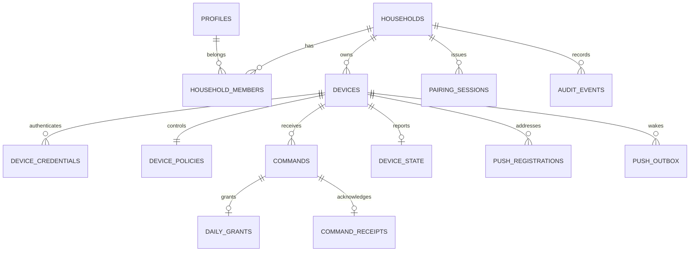

# Backend schema, RLS and transaction design

- **Goal:** Isolate tenants and devices with inspectable PostgreSQL transactions.
- **Context:** Supabase Auth parents, RLS reads, Edge device gateway, ADR-0003/0006.
- **Constraints:** No exposed production tables before migrations and allow/deny tests; elevated keys are backend only.
- **Done when:** KR-004 supplies local migrations and SQL/HTTP negative tests proving this design.

## Normalized entity model

**Local implementation status, 2026-09-11:** OD-42's prospective extension permits
KR-004 AC-5–7. [Versioned migrations](../../supabase/migrations/README.md) and actual
SQL tests implement the model and atomic control boundary; the [gateway handler](../../supabase/functions/device-gateway/README.md)
has explicit HTTP/storage-stub authorization tests. This does not imply deployed
Auth/PostgREST/Edge integration or authorize client exposure/real family use.

Proposed logical schema; exact SQL/types/functions are implementation work, not claimed deployed API.
UUID IDs unless stated; timestamps are UTC. Indexed foreign keys and tenant predicates are required.

| Entity | Key and essential fields | Relationships / constraints |
| --- | --- | --- |
| profiles | user_id PK, display_name optional, created_at | user_id → auth.users.id; email remains in Auth, avoid duplication |
| households | id PK, timezone_name, timezone_revision, created_at, deletion_state | No child name/age required; one creating owner for MVP |
| household_members | household_id + user_id PK, role, active | FKs household/profile; server-managed owner membership; no client self-promotion |
| devices | id PK, household_id, nickname, platform, model optional, os_major, agent_version, policy_epoch, revoked_at | Unique (id, household_id); device ownership immutable in normal APIs |
| pairing_sessions (private) | id PK, household_id, created_by, token_digest unique, expires_at, consumed_at, cancelled_at, device_id optional | Household set from parent membership; at most one successful redemption |
| device_credentials (private) | credential_id PK, device_id, secret_digest, created_at, expires_at, revoked_at, generation | High-entropy opaque secret, never cleartext; bounded overlapping rotation |
| credential_rotations (private) | (device_id, operation_id) PK, unique old/new credential FK, created_at, overlap_until, confirmed_at | OD-45 AC-6: serialized digest-only two-phase renewal; no ordinary client grants; fixed overlap, no plaintext response replay |
| device_policies | device_id PK, household_id, version bigint, policy_configured, daily_limit_seconds nullable until configured, manual_lock, updated_by, updated_at | Composite device FK ensures household consistency; serialized version increment; configured policy requires a valid explicit limit |
| commands | id PK, device_id, household_id, actor_user_id, version, kind, payload, period_key optional, accepted_at | Unique (device_id, version); idempotency key is operation id; actor from verified JWT |
| daily_grants | command_id PK, device_id, household_id, period_key, seconds | One grant per ADD_TIME; composite FK to matching command; sum is canonical bonus |
| command_receipts | command_id PK, device_id, snapshot_version, outcome, observed_enforcement, received_at, error_code | Own device only via gateway; cannot acknowledge future/wrong-device versions |
| device_state | device_id PK, household_id, policy_epoch, applied_version, report_sequence, period_key, used_ms, bonus_seconds, remaining_ms, manual_lock, restriction_required, restriction_applied, health, observed_at, received_at | Latest report only; monotonic report sequence within epoch; stale uploads rejected |
| push_registrations (private) | id PK, device_id, provider, address_kind, address, updated_at, invalidated_at | Unique active provider/address; registration replacement verified for same device |
| push_outbox (private) | id PK, device_id, newest_version, next_attempt_at, attempts, lease_until, state | Commit with control operation; claim via bounded transactional leasing |
| audit_events (private) | id PK, household_id nullable, actor_type/id, action, outcome, device_id optional, created_at | Minimal security/control events; no payload/tokens/content |
| rate_limit_buckets (private) | scope_hash + window_start PK, count, expires_at | Atomic limits in same DB; short retention, no raw-IP long-term history |

## RLS/access matrix

“Own” means an active membership row for verified auth.uid(), joined to the target household.
Null auth.uid() is not membership. Parent-supplied household IDs and editable user metadata never authorize.
[RLS/auth.uid](https://supabase.com/docs/guides/database/postgres/row-level-security).

| Table/action | Anonymous / public key alone | Parent own household | Parent other household | Device credential directly on Data API | Validated server route |
| --- | --- | --- | --- | --- | --- |
| profiles SELECT | Deny | Own profile only | Deny | Deny | Own profile lifecycle |
| profiles writes | Deny | Own safe columns via API only | Deny | Deny | Strict allowlist |
| households/members SELECT | Deny | Own household and own membership | Deny | Deny | Membership/bootstrap |
| household/member writes | Deny | Deny direct | Deny | Deny | Creator-only transaction, no invitation UI |
| devices/policies/state SELECT | Deny | Own | Deny | Deny | Device gets own projection only |
| commands/receipts SELECT | Deny | Own | Deny | Deny | Device gets own operations |
| any control/grant/state direct write | Deny | Deny | Deny | Deny | Authenticated typed transactions |
| credentials/pairing/push/outbox/audit/rate tables | Deny | Deny direct | Deny | Deny | Small purpose-specific allowlist |

Public schema tables require explicit RLS enablement and minimal GRANTs in the same migration.
Private tables live in a non-exposed schema with revoked anon/authenticated privileges; use RLS defence in depth.
Parent mutations use JWT-scoped calls and narrowly scoped SQL functions; privilege escalation never accepts a caller identity from JSON.
Prefer invoker functions where possible. If a definer helper is needed: fixed empty search_path, fully qualified objects, no dynamic SQL, no PUBLIC EXECUTE, explicit actor/membership checks, reviewed ownership.
Avoid recursive membership policies: own membership SELECT checks user_id = auth.uid(); household tests can safely use those rows.
Views are avoided initially. A future view must preserve caller RLS (security_invoker where supported).
[Supabase RLS](https://supabase.com/docs/guides/database/postgres/row-level-security).

## Critical transactions

OD-43's [local pairing implementation](../../supabase/functions/pairing/README.md)
now exercises creation/redemption/cancel/incomplete recovery with actual SQL and
concurrent sessions. It does not complete deployed Auth/Edge/device storage or
scheduled lifecycle integration; no exposure or real-family authorization follows.

**Household creation:** verify confirmed parent → lock/unique creator identity → create household, owner membership and profile idempotently. App metadata cannot create a second owner.
**Command:** validate parent + payload/period/version → serialize device policy row → check operation-id replay/digest → increment version → mutate desired state or insert dated grant → insert command/audit/outbox → commit → return accepted.
Do not send FCM inside the database transaction. Provider failure cannot roll back accepted policy.
**Pairing:** lock unexpired/unconsumed session → derive household → create device/credential/bootstrap policy reference → consume challenge → commit → return credential once.
**Sync read:** return policy/version, current-period bonus and operations from one consistent database snapshot. Do not perform unrelated REST reads that can interleave and label old policy with a new version.
**Acknowledge/report:** derive device from credential, validate epoch/version/target, upsert receipt idempotently, update latest state only if report_sequence advances, stamp server received_at.
**Revoke:** mark revoked, revoke all credentials, invalidate push address/outbox and pairing state, retain minimal tombstone until deletion. Every sync/command transaction rechecks revocation.

Device routes use backend credentials and therefore bypass RLS: RLS is not their authorization mechanism.
Gateway tests must independently prove each route denies a foreign device and never calls arbitrary database RPCs.
[Supabase keys](https://supabase.com/docs/guides/getting-started/api-keys), [Edge authentication](https://supabase.com/docs/guides/functions/auth).

## Negative tests required before exposure

Use two real test Auth users A/B, households HA/HB, child credentials DA/DB, and anon.
Exercise SELECT, inserts, updates, deletes, joins, guessed IDs, RPCs and views (if introduced).
A cannot read/control/enrol into HB; membership role/household columns cannot be self-mutated.
DA cannot read DB, acknowledge its commands, register its push address, select a household, create parent sessions, or issue parent controls.
Anonymous and public-key-only requests deny; deleted member with still-unexpired JWT denies.
No-policy table and forgotten GRANT tests fail closed. Test USING and WITH CHECK where writes are allowed.
Test with authenticated/anon roles, not only migration owner/service-role (which can bypass protections).
SQL tests + HTTP gateway tests are both necessary.
[Supabase database testing](https://supabase.com/docs/guides/database/testing).

## Operations and deletion

Migrations are version-controlled and tested against disposable local/test databases; no dashboard-only schema changes.
Run reset only against explicitly confirmed local/test targets; production uses reviewed forward migrations and backups.
[Database migrations](https://supabase.com/docs/guides/local-development/database-migrations).
Retention is proposed in PRIVACY. Keep expired command idempotency tombstones while the device identity remains active.
Parent deletion removes owned household state and revokes all devices before Auth deletion; do not strand foreign co-owners if a future membership model is introduced.
