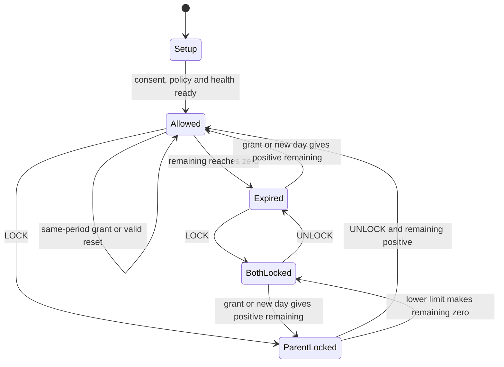

# Screen-time state machine — proposed

- **Goal:** Make Lock, Unlock, additions, usage and reset deterministic.
- **Context:** PRODUCT and ADR-0005; actual choices remain **UNSPECIFIED** pending OD-01–05/19.
- **Constraints:** Duplicate-safe, offline-capable, per-device budget; no per-app limits or schedules.
- **Done when:** KR-001 records approval and table-driven fixtures cover all transitions below.

## State

Persist milliseconds locally; API allowances/grants use whole seconds. Round only for display.
`period_key = timezone_revision + local_date`; timezone is household-confirmed IANA zone, not device zone.
`policy_epoch` identifies enrollment; `version` is the server's increasing control sequence.
`used_ms` is a non-negative locally observed cumulative amount for the period.
`bonus_seconds` is the server-derived absolute sum of accepted grants for that period, never a delta to replay.
`daily_limit_seconds` is recurring canonical allowance; `manual_lock` is a boolean.

```text
allowance_ms = (daily_limit_seconds + bonus_seconds) * 1000
remaining_ms = max(0, allowance_ms - used_ms)
time_expired = remaining_ms == 0
policy_blocked = manual_lock OR time_expired
restriction_required = policy_blocked OR accounting_uncertain OR setup_incomplete
```

The last two safety conditions are proposed separately and require owner approval.
`restriction_applied` is observed adapter state; it is not inferred from `restriction_required`.
`used_ms` may exceed a subsequently reduced allowance; never reduce consumption to fit a new limit.
Pre-enrolment/setup is not a running budget. Enforcement starts only after explicit policy, consent and local durable setup.
Safe system/emergency/recovery surfaces remain available under a blocked state, subject to KR-003 verification.

## Reason table

| Manual lock | Remaining | Policy result | Unlock result | +10 result |
| --- | --- | --- | --- | --- |
| false | positive | Allowed | No change | Increase today's allowance by 600 s |
| true | positive | Parent lock | Allowed | Still parent-locked; time retained |
| false | zero | Time expired | Still expired | Allowed if resulting allowance exceeds used time |
| true | zero | Parent lock + expired | Still expired | Parent-locked; expired reason may clear |

An allowance reduced below used time may require more than one grant before remaining becomes positive.
No action discards already consumed time.



Diagram covers policy reasons only; offline/freshness and health are orthogonal.

## Transitions

| Trigger | Atomic local/domain result | Observable acceptance |
| --- | --- | --- |
| LOCK | Newer snapshot sets manual_lock=true; first settle active use | Given 30 min, when applied, ordinary use blocked and time preserved while blocked |
| UNLOCK | Newer snapshot sets manual_lock=false | Given zero, when applied, remains expired with “Add time” guidance |
| ADD_TIME(600/1800) | Server creates one dated grant and newer snapshot; child replaces absolute bonus | Given duplicate delivery, allowance rises exactly once |
| SET_DAILY_LIMIT(n) | Replace limit; retain used, bonus and manual lock | Given 3,000 s used, set 1,800 s → zero; set 3,600 s → 600 s if not manual-locked |
| Counted usage | Integrate disjoint permitted interactive/keyguard-hidden interval | Given 60 s eligible, used grows by 60 s, never by number of foreground apps |
| Screen off/keyguard shown | Settle interval and stop counting | Given screen off for 10 min, remaining does not fall |
| Block applied | Stop permitted-use accounting | Block screen itself does not exhaust an added allowance while manual lock persists |
| Zero | Persist expiry then apply adapter; record observed result | p95 ≤ 2 s under supported healthy-device test conditions |
| New day | Used=0, bonus=0, period advances, recurring limit retained, manual lock retained | Valid local reset offline requires no server cron/command |
| Duplicate snapshot/version | No semantic change; resend receipt | State/used never roll back |
| Older version | Ignore; return last applied version | Delayed UNLOCK cannot override newer LOCK |
| New epoch | Never merge silently | Re-enrollment requires fresh explicit flow and new device identity |
| Permission lost | Permission required + enforcement degraded if needed | Do not report applied lock without working adapter |
| Clock/accounting uncertain | Preserve known state; no invented credit | Degraded reason visible locally and eventually to parent |
| Revoke received | Disable further control, clear device credential and policy under removal flow | Offline revocation is pending until contact; no remote wipe |

The parent client produces an operation UUID once per intentional tap. Network retry uses the same UUID.
A second intentional tap has a new UUID and adds another grant. Same UUID with changed payload is rejected.
A parent temporarily without backend connectivity does not silently queue new intents for later transmission; display retry error.
An accepted backend operation may remain pending on an offline child.

## Day boundaries and late delivery

The server validates the ADD_TIME period supplied by the parent against server time and household timezone; mismatch → conflict and refresh.
A grant accepted at 23:59 but delivered at 00:01 applies only to its dated period; child reports expired-for-period.
Do not move yesterday's unused bonus to today. UI must warn “For today; may expire before an offline device reconnects.”
LOCK/UNLOCK and SET_DAILY_LIMIT are persistent desired state; last accepted order wins until changed.

At a period boundary, settle an active interval on both sides of midnight using trusted instant mapping.
DST gives one budget per local date even on a 23- or 25-hour day; a skipped date does not accumulate allowances.
Device timezone and wall-clock edits do not create a new period during a boot with a trusted anchor.
Household timezone changes are not an MVP control; support migration requires a new reviewed rule/version. Travel retains household zone.

## Trustworthy time and uncertainty

Download server UTC, household zone and monotonic anchor at authenticated sync.
Within that boot, projected UTC follows elapsedRealtime, including deep sleep.
On reboot monotonic origin changes; arbitrary wall-clock manipulation plus offline reboot cannot be solved with this software clock.
Recommendation: keep current-period remaining balance, mark clock uncertain, and do not grant a new daily budget until trusted server time returns.
An already expired/manual-locked device stays restricted locally after service recovery.
If a parent requires automatic resets across arbitrary offline reboots, owner must accept RTC tampering risk or change the managed-device/support requirement.
This is an explicit product trade-off, not a proven Android capability.
[SystemClock](https://developer.android.com/reference/android/os/SystemClock).

## Numerical and concurrency rules

Recommend accepted limits 0–86,400 seconds and daily limit + bonus ≤ 86,400 seconds; exact business cap **UNSPECIFIED** (OD-19).
Reject excess with a visible error, not silent clamping. Only 600 or 1800 is accepted for ADD_TIME.
Use checked integers; reject negative, fractional, overflow and unknown enum payloads.
Server serializes control changes per device. Parent concurrent Lock/Unlock follows server sequence, not client clock.
Used consumption is local; concurrent server grants never reset it.
Expected current version is required for destructive/conflicting desired-state edits (Lock/Unlock/limit); stale parent state returns conflict for review.
ADD_TIME uses operation ID and period precondition, permitting safe distinct concurrent additions.

## Minimum examples for KR-001

1. 3,600 s base, 3,000 s used → 600 s; +10 twice intentionally → 1,800 s; retry either → still 1,800 s.
2. Manual lock + expired → Unlock remains expired → +10 restores use.
3. Manual lock + 600 s → +30 remains locked → midnight resets usage/bonus but manual lock remains.
4. Limit 1,800 after 3,000 used → zero; +10 stays zero; +30 subsequently gives 1,200.
5. Offline across midnight same boot → one reset; backward wall change → no extra reset.
6. Offline reboot after expiry → no fresh allowance from changing date; degraded state, safe recovery.
7. Version 12 LOCK then stale version 11 UNLOCK → locked.
8. Yesterday's +30 delivered today → no today's credit; receipt says expired-for-period.
