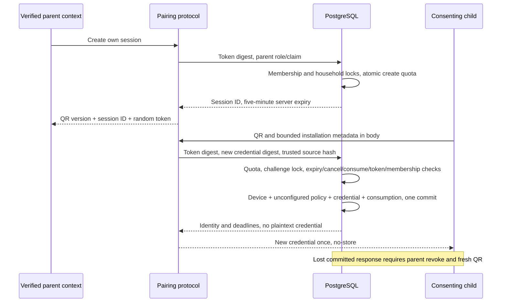

# KR-005 local pairing boundary

OD-43 permits this local slice on unmerged KR-004. No deployment, parent login, QR
scanner, production enforcement or real-family use is authorized.

`protocol.mjs` reuses Node crypto/Web Request for local fixtures, not a selected
deployed Edge runtime. `createPairing` requires a verified-parent-bound adapter,
without caller actor/household parameters. The only HTTP handler route is
`POST /pairing/redeem`: 2 KiB streaming body bound, no query, generic errors,
`Cache-Control: no-store`. The trusted source-key callback is not a forwarded header.

## Transaction and focused threat model

The QR is a possession capability, not proof of guardianship. A photographed QR can
be front-run; possession of a valid foreign QR can win its claim. A random foreign
session, mismatched token, foreign target field or actor override cannot select a
household. Scope comes exclusively from the locked session and current membership.
Parent cancellation independently checks active membership.

QR/device secrets are independent random 32-byte base64url strings, SHA-256 hashed
as canonical UTF-8. Only digests enter SQL arguments/storage. Plaintext exists in
protocol memory for the one response; no plaintext replay cache. SQL compares
fixed-length challenge digests, without claiming constant-time database execution.
The existing device handler performs constant-time digest verification before its
scope/revocation checks. No custom cryptography or password-hashing substitution.

`redeem_pairing` is service-role-only, not anonymous Data API access. `create_pairing`
and `finish_pairing` are authenticated-only with explicit membership checks. Empty
search paths, qualified objects, revoked default grants and private-table RLS remain.
Adapters must commit typed denials to retain abuse counters; only execution errors
roll back. They must not translate a denied result into transaction rollback.

Challenge row locks serialize redemption/cancel until commit. Server expiry is checked
after challenge and membership lock waits; equality is denied. Test-only injected
failure after credential insertion rolls back device/policy/credential/consumption.
No application failure-injection switch exists.
[PostgreSQL locking](https://www.postgresql.org/docs/17/explicit-locking.html),
[function security](https://www.postgresql.org/docs/17/sql-createfunction.html),
[pgcrypto](https://www.postgresql.org/docs/17/pgcrypto.html).

## Lifecycle, recovery and limits

- OD-10: five-minute single-use challenge. Before-commit retry remains possible
  while valid. After-commit response loss cannot return plaintext again. Parent
  receives `ALREADY_REDEEMED` and its own device ID, explicitly revokes incomplete
  enrollment with `finish_pairing(session, true)`, then creates a fresh QR.
- Recovery revokes device/all credentials, invalidates push and removes pending
  outbox, retaining consumption. A device with a state report is not incomplete:
  use the future reauthenticated removal route, not this shortcut. A cancellation
  losing the race returns `ALREADY_REDEEMED`, never fictitious cancellation.
- OD-20: generation one expires after 90 days and advertises day-30 rotation.
  Five-minute two-phase overlap, Android Keystore/backup exclusion, first-sync
  confirmation, expired-device re-pair UX and downloaded-policy survival remain
  ADR-0003/KR-007 integration work, **not implemented/proven by this slice**.
- ADR-0004/OD-14: incomplete enrollment cleanup after 15 minutes; expired session
  metadata and source buckets within 24 hours. Timestamps and explicit recovery
  exist; automatic scheduling/pruning and first-sync completion remain integration
  work. No deployed retention claim.
- Reused local rate recommendations: 5 creates/parent/fixed 10-minute window;
  10 redemption attempts/trusted source-minute; 5 failed token checks/session.
  Atomic counters saturate; fixed windows permit boundary bursts, not a sliding
  window guarantee. Conservative retry-after 600/60 seconds; after session lockout
  cancel/regenerate, no numeric fallback. Production quotas remain **UNSPECIFIED**.

Trusted ingress IP-to-ephemeral-key derivation, provider log scrubbing and TLS require
integration validation. Generic errors/rate limits do not eliminate theft, traffic
analysis or DoS. Caller request bodies/forwarded headers cannot supply the source key.

## Executable evidence and remaining boundaries

Use the existing [disposable runner](../../migrations/README.md); its combined checker
includes `--pairing`. Tests use real SQL roles, commits, rollback and 20 simultaneous
dblink sessions. No transaction, lock or authorization decision is mocked.
`database-protocol.mjs` exercises actual loopback HTTP with committed pairing SQL,
including response loss. It supplies real newly paired credential/device records to
the existing device handler, but **gateway sync/ack storage is stubbed** and not a
serialized database-backed device API. Parent Auth signatures, PostgREST, deployed
Edge, trusted ingress, TLS and Android storage remain unrun. No KR-006/007 GO or
KR-003 closure follows from local pairing tests.
